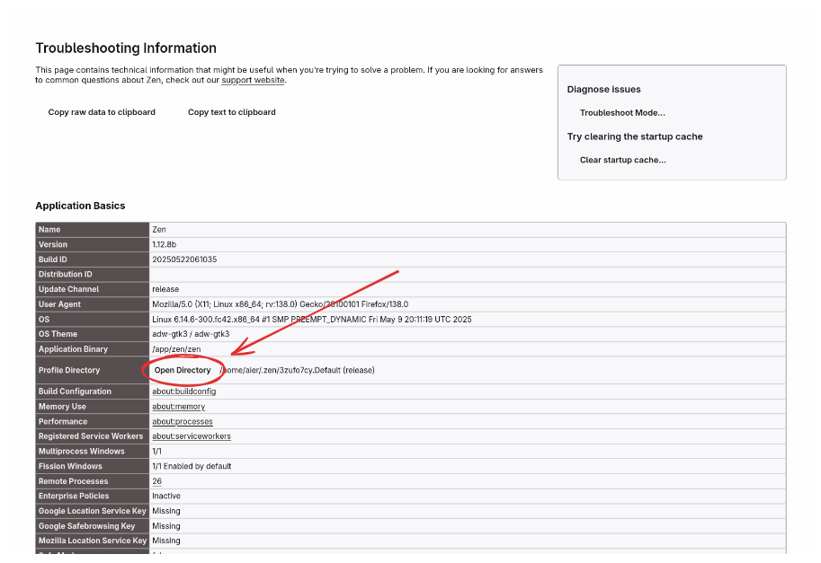
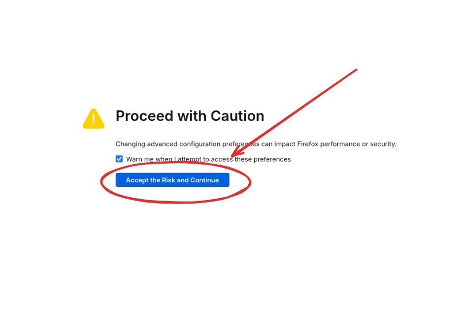

---
tags:
  - Browsers
  - Firefox
  - Zen Browser
title: Firefox Advanced Settings Tweaks (user.js)
createTime: 2025/05/22 09:05:08
permalink: /guides/firefox-userjs/
---

:::tip
This guide will walk you through a few changes you can make to your `user.js` that will make your Firefox-based experience of Linux much more polished.
:::

## Preview

This is what your `user.js` would look like if you decide to apply all tweaks mentioned in this guide. The following `user.js` contains all modifications mentioned in this guide.

:::code-tabs
@tab user.js

```js
// Scrolling
user_pref("mousewheel.default.delta_multiplier_x", 200); // 100
user_pref("mousewheel.default.delta_multiplier_y", 200); // 100
user_pref("mousewheel.default.delta_multiplier_z", 200); // 100
user_pref("general.autoScroll", true); // false

user_pref("apz.fling_friction", "0.005"); // "0.002"
user_pref("apz.gtk.pangesture.delta_mode", 2); // 0
user_pref("apz.gtk.pangesture.pixel_delta_mode_multiplier", "7"); // "40.0"
user_pref("apz.overscroll.enabled", true); // true, for linux

// Other Settings
user_pref("browser.tabs.hoverPreview.enabled", true); // false
// Zen Browser–specific settings
user_pref("zen.glance.activation-method", "alt"); // "ctrl"
user_pref("zen.splitView.change-on-hover", true); // false
user_pref("zen.tabs.vertical.right-side", true); // false
user_pref("zen.view.compact.hide-toolbar", true); // false
user_pref("zen.view.compact.toolbar-flash-popup", false); // false
```

:::

## How to append changes

### Method 1: `user.js` config file

::::steps

- Create a `user.js` by typing "about:support" into your browser and clicking "Open Directory" in the Profile Directory row.

  :::demo-wrapper
  
  :::

- Inside your profile folder, you can create a file named `user.js` if it does not exist already. You can append changes from this guide into `user.js`.

::::

### Method 2: "about:config"

::::steps

- Type in "about:config" into your browser and you'll be taken to the Firefox advanced preference page. Press "Accept risk and continue".

  :::demo-wrapper
  
  :::

- You can then type in the search bar the preference mentioned in the guide, edit the values of the preference, and create the reference if it doesn't exist.

::::

---

:::note Improving Scrolling
Many Firefox users (us included), feel that the Firefox default scrolling is quite slow on the mousewheel, or too fast on the trackpad, or not smooth enough, or not dynamic enough.

However you want your scrolling, hopefully you can customize the options we'll provide you to suit your needs.
:::

## Mousewheel scrolling

### Mousewheel speed

The mousewheel scrolling is too slow for our suiting, we can adjust this with the mousewheel delta multiplier.

```js
user_pref("mousewheel.default.delta_multiplier_x", 200); // 100
user_pref("mousewheel.default.delta_multiplier_y", 200); // 100
user_pref("mousewheel.default.delta_multiplier_z", 200); // 100
```

The default values of different flavors of Firefox may differ, but on default Firefox it is 100, and it tends to be quite slow. 200 fits our needs.

### Autoscroll

You may want to enable middle mouse button scrolling a.k.a. autoscroll (it is disabled on Linux by default).

```js
user_pref("general.autoScroll", true); // false
```

## Trackpad scrolling

The touchpad scrolling tends to be way too fast on Linux, let's slow it down and make it more similar to what we'd find on Windows or Mac.

```js
user_pref("apz.fling_friction", "0.005"); // "0.002"
user_pref("apz.gtk.pangesture.delta_mode", 2); // 0
user_pref("apz.gtk.pangesture.pixel_delta_mode_multiplier", "7"); // "40.0"
user_pref("apz.overscroll.enabled", true); // true, for linux
```

- **_apz.fling_friction_** determines how quickly the scrolling slows down.
- **_apz.gtk.pangesture.delta_mode_** set to 2 (pixel mode) ensures that scrolling takes into account display scaling (useful if you are not using 100% scaling).
- **_apz.gtk.pangesture.pixel_delta_mode_multiplier_** determines the speed of the touchpad scrolling in pixel mode. It is recommended that you set the mousewheel delta multipliers first before this value, as this value applies only to trackpads, whereas the mousewheel delta multipliers apply to both mouse and trackpad.
- **_apz.overscroll.enabled_** set to true makes the page elastic as you reaches its end, making it feel more alive.

---

## Other settings

### Hover to see preview of tab

```js
user_pref("browser.tabs.hoverPreview.enabled", true); // false
```

## Zen Browser–specific settings

If you are using Zen Browser, you can check out these settings:

```js
user_pref("zen.glance.activation-method", "alt"); // "ctrl"
user_pref("zen.splitView.change-on-hover", true); // false
user_pref("zen.tabs.vertical.right-side", true); // false
user_pref("zen.view.compact.hide-toolbar", true); // false
user_pref("zen.view.compact.toolbar-flash-popup", false); // false
```

- **_zen.glance.activation-method_** uses "alt" key to activate glance instead of "ctrl," this preserves the "open in new tab" functionality so you can keep doing ctrl+click!
- **_zen.splitView.change-on-hover_** set to true changes focus on split tabs without having to use a mouse click, similar to how Linux window managers change focus.
- **_zen.tabs.vertical.right-side_** set to true increases productivity by 200%.
- **_zen.view.compact.hide-toolbar_** set to true hides the url toolbar if you are using multiple toolbars in your Appearance settings.
- **_zen.view.compact.toolbar-flash-popup_** set to false disables the tab bar from popping up in compact mode when switching tabs.
