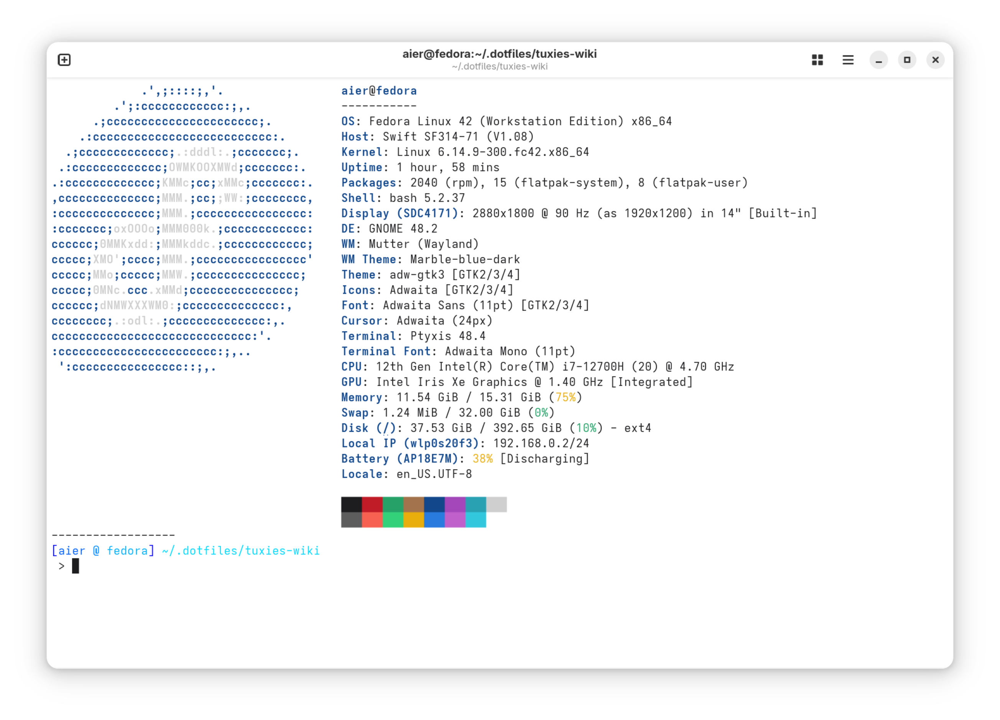
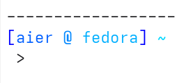

:::info
This guide will walk you through customizing your Bash prompt, how to run `fastfetch` on start in your terminal, and a few useful terminal programs.
:::

:::danger
This tutorial assumes that you are using Bash as your shell, even though some part of the tutorial may apply to non-Bash shells.

**For non-Bash users, we cannot guarantee success and will not take responsibility to damages to your system.**
:::

## Back up current `.bashrc`

Make a copy of your current `.bashrc` file and place it somewhere safe.

```bash
cp ~/.bashrc ~/.bashrc-original # Makes a copy of current .bashrc file named .bashrc-original
```

Make sure that you have a `.bashrc` file in your `/home/$USER/` at all times. If you followed the command above, you'd be fine.

You'll be editing the `.bashrc` file from your home directory in this guide, but if you ever want/need to revert back to the original file, simply replace the content in `.bashrc` from the backup you've made.

:::::collapse

- Here is an exemplar `.bashrc` file taken from my Fedora 42 Workstation (hopefully you don't have to use this):

  :::code-tabs

  @tab .bashrc

  ```bash
  # .bashrc

  # Source global definitions
  if [ -f /etc/bashrc ]; then
      . /etc/bashrc
  fi

  # User specific environment
  if ! [[ "$PATH" =~ "$HOME/.local/bin:$HOME/bin:" ]]; then
      PATH="$HOME/.local/bin:$HOME/bin:$PATH"
  fi
  export PATH

  # Uncomment the following line if you don't like systemctl's auto-paging feature:
  # export SYSTEMD_PAGER=

  # User specific aliases and functions
  if [ -d ~/.bashrc.d ]; then
      for rc in ~/.bashrc.d/*; do
          if [ -f "$rc" ]; then
              . "$rc"
          fi
      done
  fi
  unset rc
  ```

  :::

:::::

## Aesthetic changes

:::::collapse

- Preview

  Your `.bashrc` should look something like this if you decide to follow all instructions in the following section:

  ::: code-tabs

  @tab .bashrc

  ```bash
  # ... omitted original .bashrc content above

  fastfetch

  PS1='------------------\n\[$(tput setaf 21)\][\[$(tput setaf 27)\]\u \[$(tput setaf 33)\]@ \[$(tput setaf 39)\]\h\[$(tput setaf 21)\]] \[$(tput setaf 45)\]\w\[$(tput sgr0)\]\n > '
  ```

  :::

  

:::::

### Autorun `fastfetch` when you open the terminal

You can make your bash terminal autorun `fastfetch` to display system information every time it starts by appending the following at the bottom of your file.

::::steps

- Installation

  :::tabs
  @tab Debian/Ubuntu

  ```bash
  sudo apt install fastfetch
  ```

  @tab Fedora

  ```bash
  sudo dnf install fastfetch
  ```

  @tab Arch

  ```bash
  pacman -S fastfetch
  ```

  :::

- Set up `fastfetch` in shell

  You can append the following at the bottom of your `.bashrc`:

  :::code-tabs
  @tab .bashrc

  ```bash
  fastfetch
  ```

  :::

  and here is what it looks like:

  :::demo-wrapper
  
  :::

- Changing the look of the prompt (`PS1`)

  Now, in your `.bashrc`, you change the looks of your prompt looks through modifying the `PS1` variable.

  You can append the following at the bottom of your `.bashrc`:

  :::code-tabs
  @tab .bashrc

  ```bash
  PS1='------------------\n\[$(tput setaf 56)\][$(tput setaf 56)\]\u \[$(tput setaf 92)\]@ \[$(tput setaf 128)\]\h\[$(tput setaf 128)\]] \[$(tput setaf 200)\]\w\[$(tput sgr0)\]\n > '
  ```

  :::

  and here is what it looks like:

  

- More resources

  - [`PS1` customization by Rahul from tecadmin.net](https://tecadmin.net/how-to-customize-bash-prompt-ps1-in-linux/)

::::

## Terminal programs

:::::collapse

- Preview

  Your `.bashrc` should look something like this if you decide to follow all instructions in the following section:

  :::code-tabs
  @tab .bashrc

  ```bash
  # ... omitted original .bashrc content above

  #### fzf-related aliases ####
  alias cmd='compgen -c | fzf' # search for a possible command
  alias zh='history | fzf' # search in bash command history

  #### enabling zoxide ####
  eval "$(zoxide init bash)"

  #### eza-related aliases ####
  # list directories in a tree format (or specify how many levels to list them)
  alias lsd='eza -TD'
  alias lsd1='eza -TD --level 1'
  alias lsd2='eza -TD --level 2'
  alias lsd3='eza -TD --level 3'
  # list items in tree format (or specify how many levels to list them)
  alias lst='eza -T'
  alias lst1='eza -T --level 1'
  alias lst2='eza -T --level 2'
  alias lst3='eza -T --level 3'
  # list all directories in tree format including hidden ones (or specify how many levels to list them)
  alias lsda='eza -TDa'
  alias lsda1='eza -TDa --level 1'
  alias lsda2='eza -TDa --level 2'
  alias lsda3='eza -TDa --level 3'
  # list all items in tree format including hidden ones (or specify how many levels to list them)
  alias lsta='eza -Ta'
  alias lsta1='eza -Ta --level 1'
  alias lsta2='eza -Ta --level 2'
  alias lsta3='eza -Ta --level 3'
  ```

  :::

:::::

### Using `fzf` (Fuzzy Find)

:::tip What is `fzf`?

`fzf` is a command-line fuzzy finder that helps you quickly search and navigate files, directories, command history, and more.
:::

::::steps

- Installation

  :::tabs
  @tab Debian/Ubuntu

  ```bash
  sudo apt install fzf
  ```

  @tab Fedora

  ```bash
  sudo dnf install fzf
  ```

  @tab Arch

  ```bash
  pacman -S fzf
  ```

  :::

- Add aliases

  Below are example aliases:

  :::code-tabs

  @tab .bashrc

  ```bash
  alias cmd='compgen -c | fzf' # search for a possible command
  alias zh='history | fzf' # search in bash command history
  ```

  :::

- More resources

  - [Tutorial](https://youtu.be/MvLQor1Ck3M?si=t23i-fsLL57QyuzU&t=50) on how to use `fzf` by DevOps Toolbox
  - [Use `fzf` with `zoxide`](https://www.youtube.com/watch?v=aghxkpyRVDY) by Dreams of Autonomy
  - [More info](https://github.com/junegunn/fzf?tab=readme-ov-file) about `fzf` from the official `fzf` GitHub page.

::::

### Using `zoxide`

:::tip What is `zoxide`?
`zoxide` is a terminal program that is like `cd` on steroids. It provides `cd`'s functionality with the addition of being able to jump to directories with short, fuzzy-matched commands.
:::

::::steps

- Installation

  :::tabs
  @tab Debian/Ubuntu

  ```bash
  sudo apt install zoxide
  ```

  @tab Fedora

  ```bash
  sudo dnf install zoxide
  ```

  @tab Arch

  ```bash
  sudo pacman -S zoxide
  ```

  :::

- Set up `zoxide` in your Bash shell

  Append the following to your `.bashrc`:

  :::code-tabs
  @tab .bashrc

  ```bash
  eval "$(zoxide init bash)"
  ```

  :::

- More resources

  - [Tutorial](https://www.youtube.com/watch?v=aghxkpyRVDY&t=83s) on how to use `zoxide` by Dreams of Autonomy (includes how to use it with `fzf`, too)
  - [More info](https://github.com/ajeetdsouza/zoxide) about `zoxide` from the official `zoxide` GitHub page

::::

### Using `eza`

:::tip What is `eza`?
`eza` is a modern alternative to the classic `ls`, it provides color-coding, tree-styled outputs, git integration, and more.
:::

:::::steps

- Installation

  ::::tabs
  @tab Debian/Ubuntu

  ```bash
  sudo apt install eza
  ```

  @tab Fedora

  :::important As of Fedora 42, there is no maintainer for `eza` so you'll be unable to download `eza` through `dnf`.
  :::

  ```bash
  sudo dnf install eza

  ```

  @tab Arch

  ```bash
  pacman -S eza
  ```

  ::::

- Add aliases

  Below are some example aliases:
  :::code-tabs

  @tab .bashrc

  ```bash
  # list directories in a tree format (or specify how many levels to list them)
  alias lsd='eza -TD'
  alias lsd1='eza -TD --level 1'
  alias lsd2='eza -TD --level 2'
  alias lsd3='eza -TD --level 3'
  # list items in tree format (or specify how many levels to list them)
  alias lst='eza -T'
  alias lst1='eza -T --level 1'
  alias lst2='eza -T --level 2'
  alias lst3='eza -T --level 3'
  # list all directories in tree format including hidden ones (or specify how many levels to list them)
  alias lsda='eza -TDa'
  alias lsda1='eza -TDa --level 1'
  alias lsda2='eza -TDa --level 2'
  alias lsda3='eza -TDa --level 3'
  # list all items in tree format including hidden ones (or specify how many levels to list them)
  alias lsta='eza -Ta'
  alias lsta1='eza -Ta --level 1'
  alias lsta2='eza -Ta --level 2'
  alias lsta3='eza -Ta --level 3'
  ```

  :::

- More resources

  - [Quick overview](https://www.youtube.com/watch?v=mmqDYw9C30I&t=615s) on `eza` by Josean Martinez

:::::
