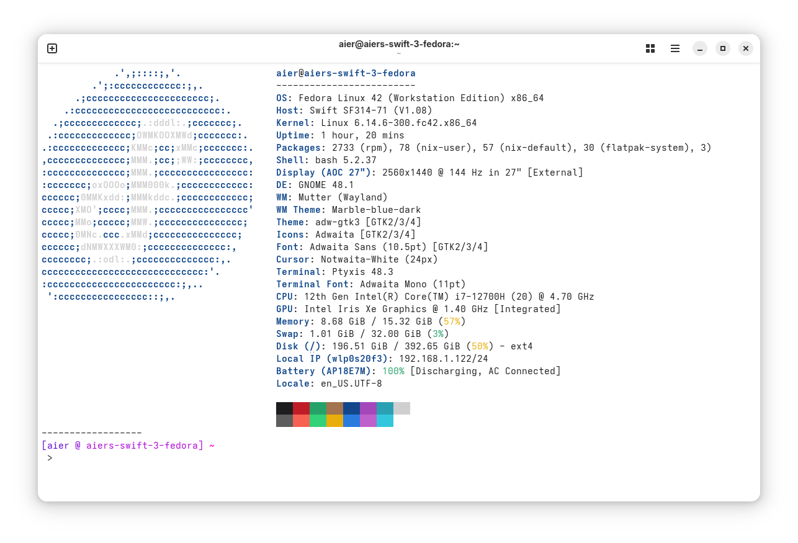
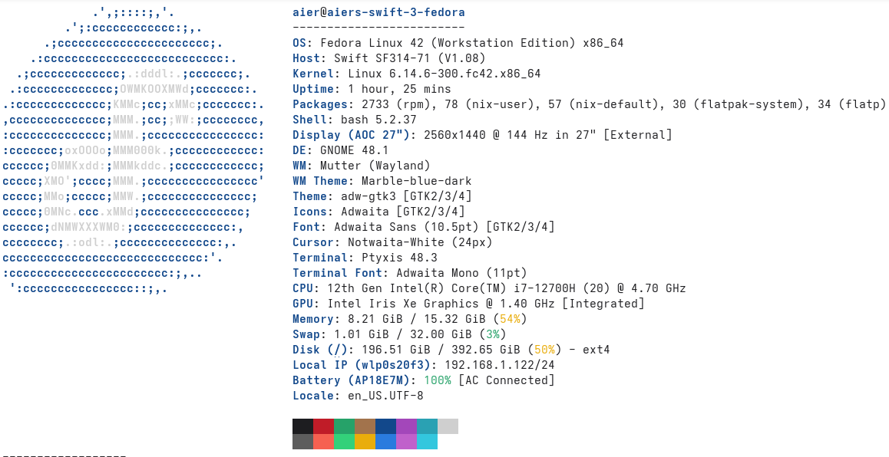

:::info
This guide will walk you through customizing your Bash prompt, how to run `fastfetch` on start in your terminal, and a few useful terminal programs.
:::

:::danger
This tutorial assumes that you are using Bash as your shell, even though some part of the tutorial may apply to non-Bash shells.

**For non-Bash users, we cannot guarantee success and will not take responsibility to damages to your system.**
:::

## Back up current `.bashrc`

Make a copy of your current `.bashrc` file and place it somewhere safe.

```bash
cp ~/.bashrc ~/.bashrcOriginal # Makes a copy of current .bashrc file named .bashrcOriginal
```

Make sure that you have a `.bashrc` file in your `/home/$USER/` at all times. If you followed the command above, you'd be fine.

You'll be editing the `.bashrc` file from your home directory in this guide, but if you ever want/need to revert back to the original file, simply replace the content in `.bashrc` from the backup you've made.

Here is an exemplar `.bashrc` file taken from my Fedora 42 Workstation (hopefully you don't have to use this):

```bash
# .bashrc

# Source global definitions
if [ -f /etc/bashrc ]; then
    . /etc/bashrc
fi

# User specific environment
if ! [[ "$PATH" =~ "$HOME/.local/bin:$HOME/bin:" ]]; then
    PATH="$HOME/.local/bin:$HOME/bin:$PATH"
fi
export PATH

# Uncomment the following line if you don't like systemctl's auto-paging feature:
# export SYSTEMD_PAGER=

# User specific aliases and functions
if [ -d ~/.bashrc.d ]; then
    for rc in ~/.bashrc.d/*; do
        if [ -f "$rc" ]; then
            . "$rc"
        fi
    done
fi
unset rc
```

## Aesthetic changes

### Preview

Your `.bashrc` should look something like this if you decide to follow all instructions in the following section:

```bash
# ... omitted original .bashrc content above

fastfetch

PS1='------------------\n\[$(tput setaf 56)\][$(tput setaf 56)\]\u \[$(tput setaf 92)\]@ \[$(tput setaf 128)\]\h\[$(tput setaf 128)\]] \[$(tput setaf 200)\]\w\[$(tput sgr0)\]\n > '
```



### Autorun `fastfetch` when you open the terminal

You can make your bash terminal autorun `fastfetch` to display system information every time it starts by appending the following at the bottom of your file.

::::steps

1.  Installation

    :::tabs
    @tab Debian/Ubuntu

    apt install fastfetch

    @tab Fedora

    dnf install fastfetch

    @tab Arch

    pacman -S fastfetch
    :::

2.  Set up `fastfetch` in shell

    You can append the following at the bottom of your `.bashrc`:

    ```bash
    fastfetch
    ```

    and here is what it looks like:

    :::demo-wrapper
    
    :::

3.  Changing the look of the prompt (`PS1`)

    Now, in your `.bashrc`, you change the looks of your prompt looks through modifying the `PS1` variable.

    You can append the following at the bottom of your `.bashrc`:

    ```bash
    PS1='------------------\n\[$(tput setaf 56)\][$(tput setaf 56)\]\u \[$(tput setaf 92)\]@ \[$(tput setaf 128)\]\h\[$(tput setaf 128)\]] \[$(tput setaf 200)\]\w\[$(tput sgr0)\]\n > '
    ```

    and here is what it looks like:

    

4.  More resources

    - [`PS1` customization by Rahul from tecadmin.net](https://tecadmin.net/how-to-customize-bash-prompt-ps1-in-linux/)

::::

## Terminal programs

### Preview

Your `.bashrc` should look something like this if you decide to follow all instructions in the following section:

```bash
# ... omitted original .bashrc content above

#### fzf-related aliases ####
alias cmd='compgen -c | fzf' # search for a possible command
alias zh='history | fzf'# search in bash command history

#### enabling zoxide ####
eval "$(zoxide init bash)"

#### eza-related aliases ####
# list directories in a tree format (or specify how many levels to list them)
alias lsd='eza -TD'
alias lsd1='eza -TD --level 1'
alias lsd2='eza -TD --level 2'
alias lsd3='eza -TD --level 3'
# list items in tree format (or specify how many levels to list them)
alias lst='eza -T'
alias lst1='eza -T --level 1'
alias lst2='eza -T --level 2'
alias lst3='eza -T --level 3'
# list all directories in tree format including hidden ones (or specify how many levels to list them)
alias lsda='eza -TDa'
alias lsda1='eza -TDa --level 1'
alias lsda2='eza -TDa --level 2'
alias lsda3='eza -TDa --level 3'
# list all items in tree format including hidden ones (or specify how many levels to list them)
alias lsta='eza -Ta'
alias lsta1='eza -Ta --level 1'
alias lsta2='eza -Ta --level 2'
alias lsta3='eza -Ta --level 3'
```

### Using `fzf` (Fuzzy Find)

:::tip What is `fzf`?

`fzf` is a command-line fuzzy finder that helps you quickly search and navigate files, directories, command history, and more.
:::

::::steps

1.  Installation

    :::tabs
    @tab Debian/Ubuntu

    apt install fzf

    @tab Fedora

    dnf install fzf

    @tab Arch

    pacman -S fzf
    :::

2.  Add aliases

        Below are example aliases:

        ```bash
        alias cmd='compgen -c | fzf' # search for a possible command
        alias zh='history | fzf'# search in bash command history
        ```

3.  More resources

    - [Tutorial](https://youtu.be/MvLQor1Ck3M?si=t23i-fsLL57QyuzU&t=50) on how to use `fzf` by DevOps Toolbox
    - [Use `fzf` with `zoxide`](https://www.youtube.com/watch?v=aghxkpyRVDY) by Dreams of Autonomy
    - [More info](https://github.com/junegunn/fzf?tab=readme-ov-file) about `fzf` from the official `fzf` GitHub page.

::::

### Using `zoxide`

:::tip What is `zoxide`?
`zoxide` is a terminal program that is like `cd` on steroids. It provides `cd`'s functionality with the addition of being able to jump to directories with short, fuzzy-matched commands.
:::

::::steps

1.  Installation

    :::tabs
    @tab Debian/Ubuntu

    apt install zoxide

    @tab Fedora

    dnf install zoxide

    @tab Arch

    pacman -S zoxide
    :::

2.  Set up `zoxide` in your Bash shell

        Append the following to your `.bashrc`:

        ```bash
        eval "$(zoxide init bash)"
        ```

3.  More resources

    - [Tutorial](https://www.youtube.com/watch?v=aghxkpyRVDY&t=83s) on how to use `zoxide` by Dreams of Autonomy (includes how to use it with `fzf`, too)
    - [More info](https://github.com/ajeetdsouza/zoxide) about `zoxide` from the official `zoxide` GitHub page

::::

### Using `eza`

:::tip What is `eza`?
`eza` is a modern alternative to the classic `ls`, it provides color-coding, tree-styled outputs, git integration, and more.
:::

::::steps

1. Installation

   :::tabs
   @tab Debian/Ubuntu

   apt install eza

   @tab Fedora

   dnf install eza

   @tab Arch

   pacman -S eza
   :::

2. Add aliases

   Below are some example aliases:

   ```bash
   # list directories in a tree format (or specify how many levels to list them)
   alias lsd='eza -TD'
   alias lsd1='eza -TD --level 1'
   alias lsd2='eza -TD --level 2'
   alias lsd3='eza -TD --level 3'
   # list items in tree format (or specify how many levels to list them)
   alias lst='eza -T'
   alias lst1='eza -T --level 1'
   alias lst2='eza -T --level 2'
   alias lst3='eza -T --level 3'
   # list all directories in tree format including hidden ones (or specify how many levels to list them)
   alias lsda='eza -TDa'
   alias lsda1='eza -TDa --level 1'
   alias lsda2='eza -TDa --level 2'
   alias lsda3='eza -TDa --level 3'
   # list all items in tree format including hidden ones (or specify how many levels to list them)
   alias lsta='eza -Ta'
   alias lsta1='eza -Ta --level 1'
   alias lsta2='eza -Ta --level 2'
   alias lsta3='eza -Ta --level 3'
   ```

3. More resources

   - [Quick overview](https://www.youtube.com/watch?v=mmqDYw9C30I&t=615s) on `eza` by Josean Martinez

::::
