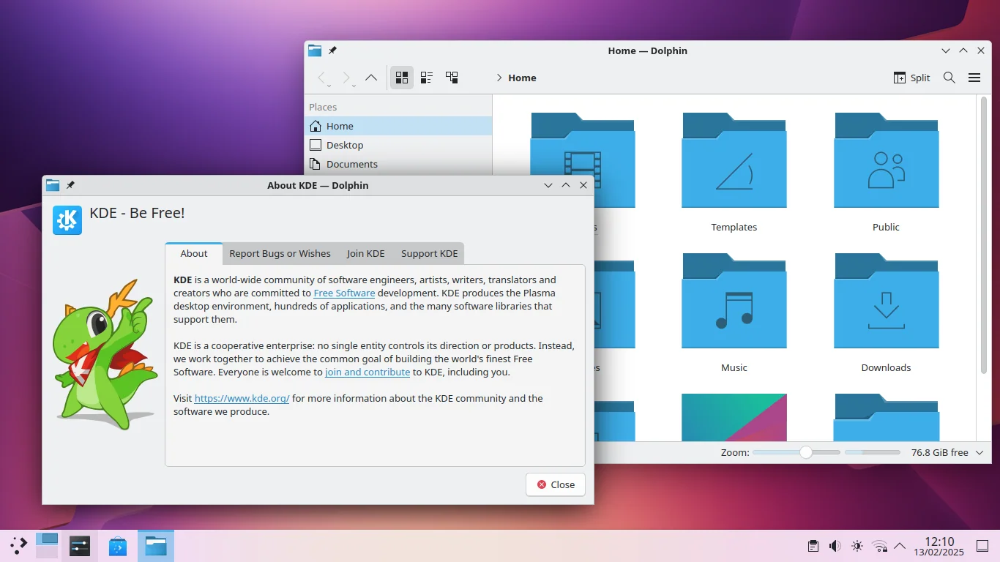
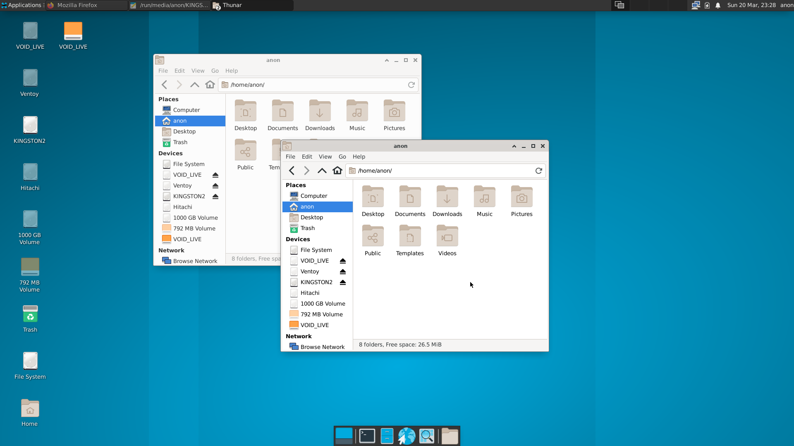

:::important The following list of Linux vocabularies are commonly used within the Linux community, thus it's extremely helpful not only while navigating Tuxie's Wiki but also for future reference. The definitions are simplified to be beginner friendly.
:::

## **Core Concepts**

:::::collapse

- :+ FOSS — Free and Open-Source Software

  Free means you can use the software without paying for it, but it can also refer to the freedom to run, study, change, and share the software however you like. Open source means the source code — the actual blueprint of the software — is available for anyone to look at, modify, or improve. FOSS is transparent, collaborative, and serves the community.

- OS — Operating System

  An OS is a core layer of software that acts as a bridge between your computer's hardware and the applications you run. e.g. Windows, macOS, GNU/Linux.

- GNU/Linux

  A free and open source Unix-like operating system powered by the GNU collection of free software and the Linux Kernel. This set of software forms the operating system that we usually refer to simply as "Linux".

## **Parts of the GNU/Linux OS**

- **Linux Kernel**

  Kernel is the core part of the OS that manages hardware, processes, and memory. e.g. the Linux kernel.

  Linux is a free and open source created by Linus Torvalds in 1991 and has since become the foundation for many operating systems. The word "Linux" by itself is often used to refer to Linux Distros.

- :+ DE — Desktop Environment

  A desktop interface that where users can interact with application windows. (e.g., GNOME, KDE Plasma, XFCE).

  | Desktop Environment | Demo Image                             | Description                                                                                                        |
  | ------------------- | -------------------------------------- | ------------------------------------------------------------------------------------------------------------------ |
  | **GNOME**           |            | A clean, modern interface with a focus on simplicity and productivity. Default in Fedora, Ubuntu, and many others. |
  | **KDE Plasma**      |  | Highly customizable. Offers a Windows-like experience with many advanced features.                                 |
  | **Xfce**            |              | Lightweight and fast. Great for older hardware or users who prefer a traditional desktop layout.                   |

- :+ Distros — Linux Distributions

  Distros are different versions of the GNU/Linux OS, each with varying packages and focuses from the other.

  |                       | Distro         | Description                                                                                                                |
  | --------------------- | -------------- | -------------------------------------------------------------------------------------------------------------------------- |
  | ::devicon:fedora::    | **Fedora**     | A nice out-of-the-box experience. Simple to use and cutting edge at the same time.                                         |
  | ::devicon:archlinux:: | **Arch Linux** | DIY approach. Can be extremely minimal as it does not come with a GUI installer nor any DE by default. For advanced users. |
  | ::devicon:debian::    | **Debian**     | Stable and receives a new release every 2 years, often the base for other distros like Ubuntu.                             |
  | ::devicon:ubuntu::    | **Ubuntu**     | Beginner-friendly, popular on desktops and servers.                                                                        |
  | ::devicon:linuxmint:: | **Linux Mint** | Ubuntu-based with a familiar Windows-like feel.                                                                            |

- :+ Terminal — Command Line Interface, CLI

  A text-based interface to interact with the OS by typing commands.

  

- Shell

  The command-line interpreter (e.g., Bash, Zsh) that executes user commands.

  **Bourne Again Shell (Bash)** — The default shell in most Linux distributions.

- GUI — Graphical User Interface

  A visual interface with windows, icons, and menus (e.g., settings apps, software stores).

- WM — Window Manager

  Software that controls window placement and appearance. (e.g., Hyprland, i3, Openbox). DEs like Gnome and KDE often come with their own.

:::::

:::warning ALL CONTENT BELOW ARE UNDER CONSTRUCTION
:::

## **System & File Management**

**Root**: The user with full system control (root user, /root directory).

**sudo (SuperUser DO)**: A command to run programs with root privileges.

**Path**: The location of a file/directory (e.g., `/usr/bin/python3`).

**Symlink (Symbolic Link)**: A shortcut pointing to another file/directory (like Windows shortcuts).

**Alias**: A custom shortcut for a command (e.g., `alias ll='ls -la'`).

## **Package & Software Management**

**Package Manager**: A tool to install/remove software (e.g., `apt` — Debian, `dnf` — Fedora, `pacman` — Arch).

**Repository (Repo)**: A server hosting software packages for download.

**Dependency**: Additional software required for a program to run.

**Flatpak**: A universal package format that works across Linux distros (sandboxed).

## **Networking & Permissions**

**SSH (Secure Shell)**: A protocol for secure remote login (`ssh user@host`).

**IP (Internet Protocol)**: A unique address for network communication (`ifconfig`/`ip a`).

## **Processes & System Control**

**Daemon**: A background service (e.g., `sshd` for SSH).

**Systemd**: A modern init system managing services (`systemctl start/stop`).

<!-- ## Must know vocabularies

Linux: A free, open-source Unix-like operating system (like Windows and MacOS), often used to cover the entirety of different distributions e.g., Debian, Ubuntu, Fedora, Arch.

Kernel: The intermidiate part or a bridge that links software applications and hardware. It manages system resources including CPU, memory, disks, processes, device drivers, etc.

Terminal: A text-based interface to control the operating system.

Shell: The command-line interpreter (e.g., Bash, Zsh) that executes user commands.

Bash: The default shell in most Linux distributions.

Desktop Environment (DE): A complete graphical interface (e.g., GNOME, KDE Plasma, XFCE).

Flatpak:

Package Manager:

Repository (Repo):

SSH:

IP:

Daemon:

Systemd:

Partition:

Basic Input/Output System (BIOS):

Unified Extensible Firmwawre Interface (UEFI):

Initramfs:

ISO:

Firmware:

Grand Unified Bootloader (GRUB):

Command Line Interface (CLI):

Graphical User Interface (GUI):

Window Manager:

Alias:

Dependency:

Sudo:

Root:

Path:

Virtualization: -->
