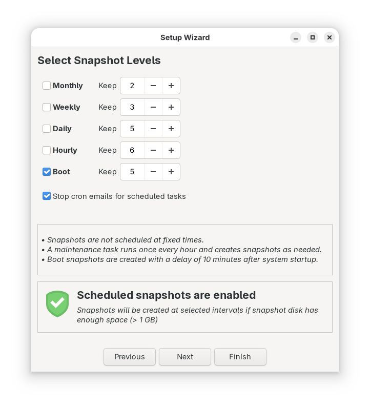
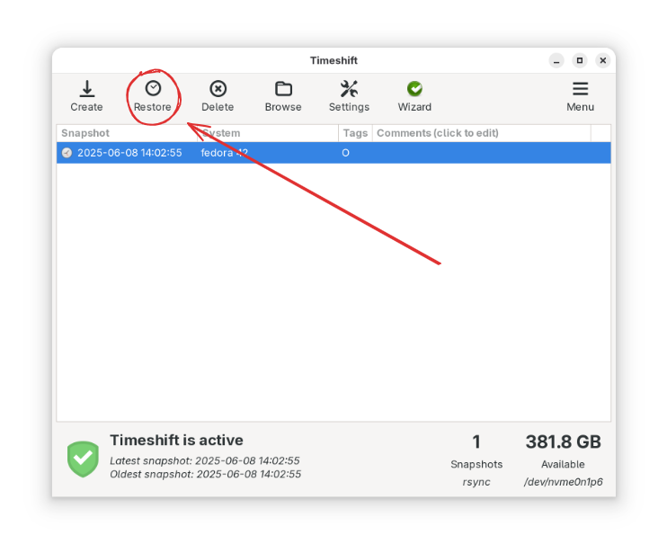

::::card-grid

:::card title="Author(s)" icon="fluent-emoji:writing-hand"
aier
:::

<!-- :::card title="Co-author(s)" icon="fluent-emoji:two-hearts"
::: -->

::::

:::tip Why Fedora?
Fedora is the preferred distro of **aier**. Fedora offers a high-quality out-of-the-box experience while remaining highly flexible. It is stable, yet it has up-to-date and cutting edge packages.
:::

## **Installation**

::::steps

- **Install Fedora onto your machine**

  :::warning TODO: A video step to step installation.
  :::

  - [How to Install Fedora Step by Step](https://www.linuxtechi.com/how-to-install-fedora-workstation/) by Pradeep Kumar from Linux Techi.

  - [NVIDIA Drivers Guide](https://rpmfusion.org/Howto/NVIDIA#Current_GeForce.2FQuadro.2FTesla) by Official RPM Fusion.

  - [Fedora on MacBook](https://asahilinux.org/fedora/) by Official Asahi Linux.

- **Update system**

  :::tabs
  @tab Terminal

  ```bash
  sudo dnf update -y
  ```

  @tab GUI (Gnome Software)
  
  :::

- **Reboot**

  ```bash
  reboot
  ```

::::

## **Create snapshots/backups** for your computer

:::important This is highly recommended unless your disk space is limited.
:::

We'll be using **Timeshift**, but you can use whichever snapshot/backup tool you like.

::::steps

- **SELinux compatibility**

  Fedora Workstation and many other spins enforces SELinux by default.

  If you want to use Timeshift with SELinux, you might want to set SELinux mode from “enforcing” to “permissive” to enable proper function among kernel versions.

  :::code-tabs

  @tab /etc/selinux/config

  ```bash
  # [!code --]
  SELINUX=enforcing
  # [!code ++]
  SELINUX=permissive
  ```

  :::

  Restart your computer after the modification.

  ```bash
  reboot
  ```

- **Install Timeshift**

  ```bash
  sudo dnf install timeshift
  ```

- **Go through the setup wizard**

  :::details I recommend keeping 3–5 boot snapshots.

  

  :::

- **Restore backup when needed**

  :::details Choose the snapshot you wish to restore and voila!

  

  :::

::::

## **Further customization**

From this point on, customization for your Fedora installation would mainly be based on the DE that you are using.

- [Gnome Guide](./gnome.md)
