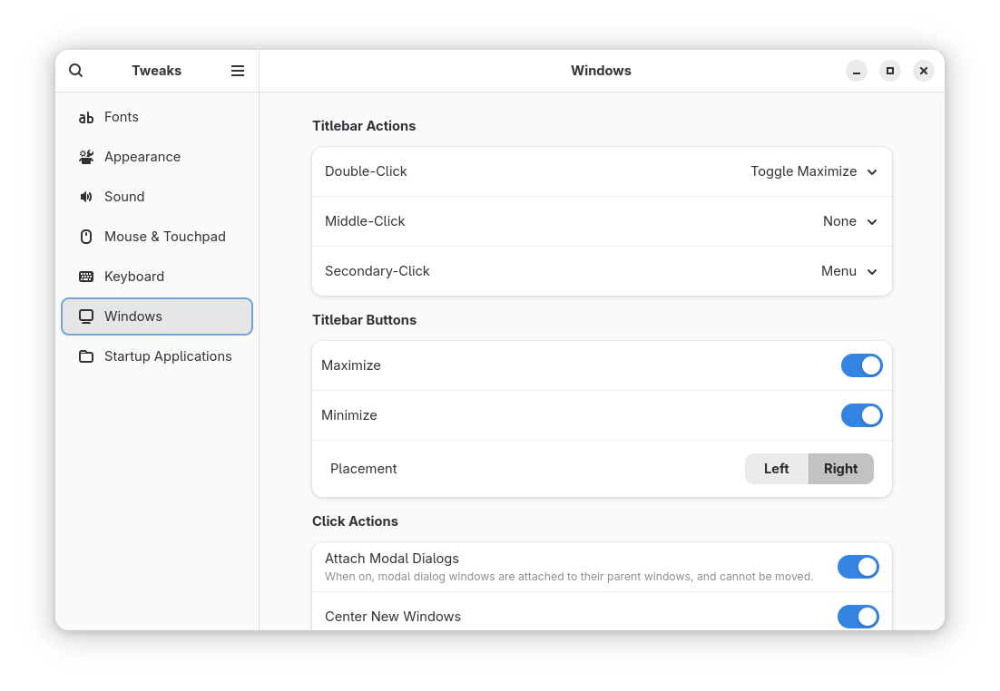
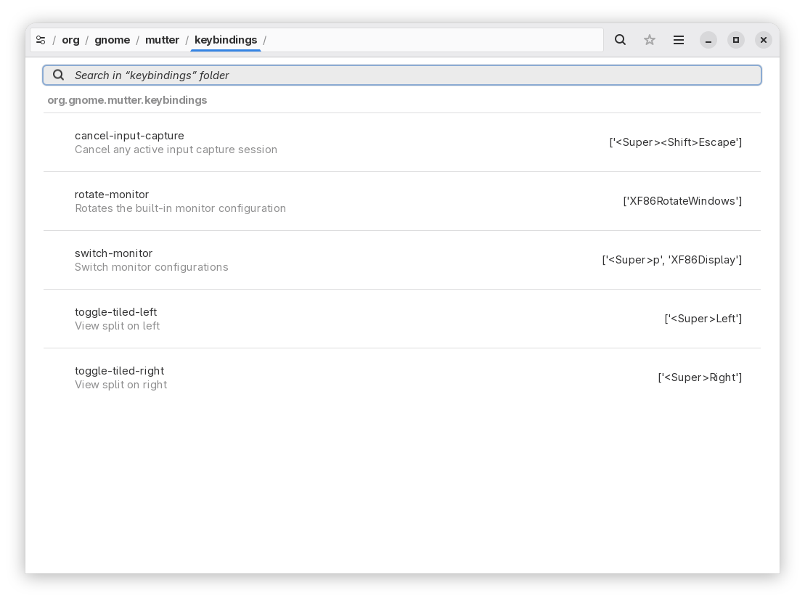
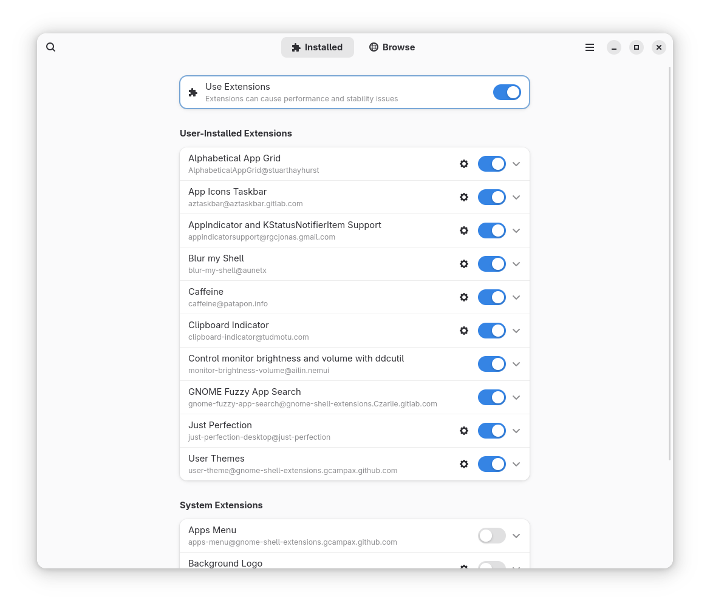
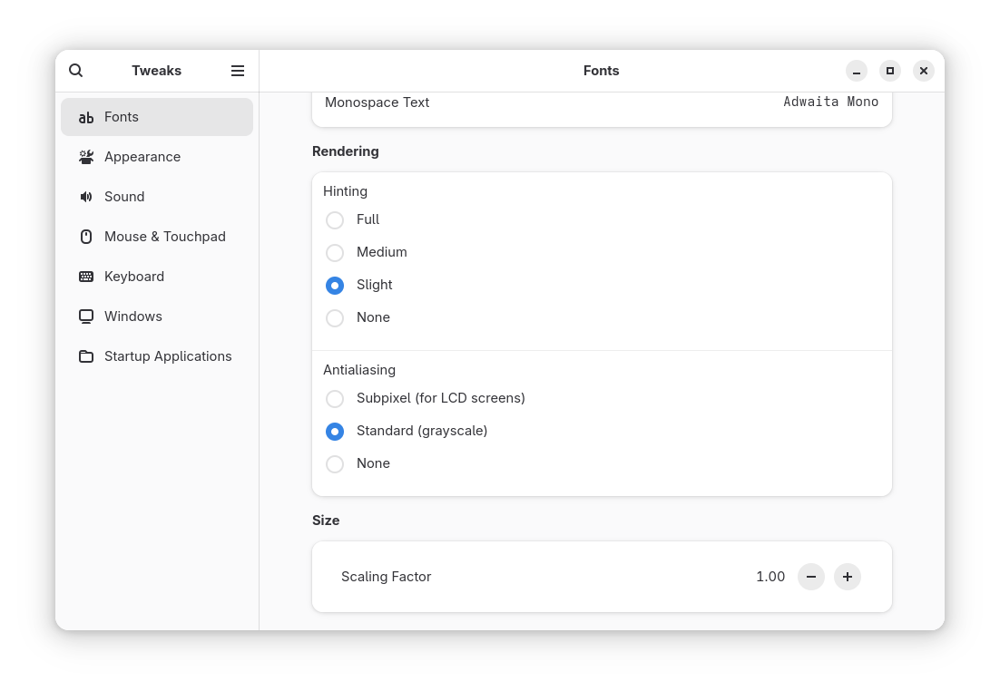
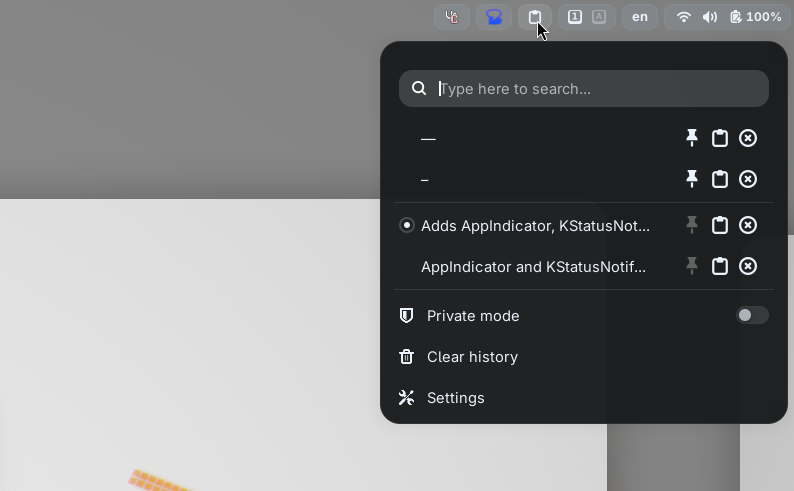
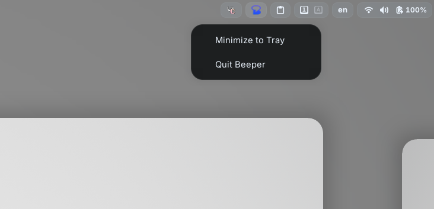
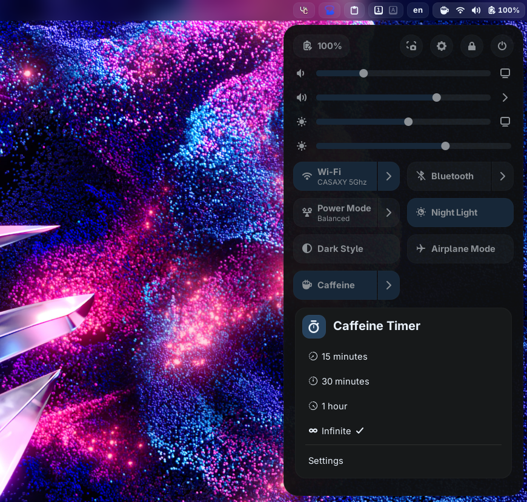

::::card-grid

:::card title="Author(s)" icon="fluent-emoji:writing-hand"
aier
:::

:::card title="Co-author(s)" icon="fluent-emoji:two-hearts"
Lunear
:::

::::

:::tip Why Gnome?
Gnome is clean and highly functional (though it follows quite a strict and somehow stubborn philosophy). The Gnome workflow may be quite different compared what you are used to, but once you have gotten the hang of it, you may just fall in love.

Read over this guide to customize Gnome to ==your== liking!
:::

:::note Haven't decided on a distro yet?
Check out [Linux Guides](../linux-guides/README.md) to learn more about distros.
:::

## **First steps**

### Go through the `Settings` app and make some quick tweaks to your needs.

- ==Display== — Adjust refresh rate and resolution as needed.
- ==Power== — Change performance mode, show battery %, change suspend behavior, and more.
- ==Multitasking== — Adjust according to your workflow.
- ==Appearance== — You can add your own wallpaper and change to dark mode.
- ==Online Accounts== — You can connect to your online accounts to access calendar, cloud drives, and more within Gnome apps.
- ==Mouse & Trackpad== — You can change pointer sensitivity and turn acceleration on/off.
- ==Keyboard== — Add and modify keyboard shortcuts and change keyboard input settings.

### Install some apps for more advanced options

:::tip You can always use your distro's GUI software store (such as Gnome's `Software` instead of the terminal).
:::

:::tip Install these apps if you wish to unlock settings changes that are not easily accessible with the stock `Settings` app.
:::

:::::collapse accordion

- Gnome Tweaks

  ::::card
  :::tabs

  @tab ::devicon:fedora:: Fedora

  ```bash
  sudo dnf install gnome-tweaks
  ```

  @tab ::devicon:archlinux:: Arch

  ```bash
  sudo pacman -S gnome-tweaks
  ```

  @tab ::devicon:debian:: Debian/Ubuntu

  ```bash
  sudo apt install gnome-tweaks
  ```

  :::

  

  [More details...](../linux-apps/gnomie.md#gnome-tweaks)

  ::::

- Dconf Editor

  ::::card
  :::tabs

  @tab ::devicon:fedora:: Fedora

  ```bash
  sudo dnf install dconf-editor
  ```

  @tab ::devicon:archlinux:: Arch

  ```bash
  sudo pacman -S dconf-editor
  ```

  @tab ::devicon:debian:: Debian/Ubuntu

  ```bash
  sudo apt install dconf-editor
  ```

  :::

  

  [More details...](../linux-apps/gnomie.md#dconf-editor)

  ::::

- Extension Manager

  ::::card

  :::tabs

  @tab Flatpak (System)

  ```bash
  flatpak install flathub com.mattjakeman.ExtensionManager
  ```

  @tab Flatpak (User)

  ```bash
  flatpak install --user flathub com.mattjakeman.ExtensionManager
  ```

  :::

  

  [More details...](../linux-apps/gnomie.md#extension-manager)
  ::::
  :::::

## **Highly recommended tweaks**

:::tip All settings in `Gnome Tweaks` can be made through `Dconf Editor` (which you have downloaded), `dconf`, and `gsettings`.
:::

::::details Quick append

:::tabs

@tab Append changes

```bash
dconf write /org/gnome/desktop/wm/preferences/button-layout "':minimize,maximize,close'"
dconf write /org/gnome/desktop/interface/font-antialiasing "'grayscale'"
dconf write /org/gnome/desktop/interface/font-hinting "'slight'"
dconf write /org/gnome/desktop/sound/allow-volume-above-100-percent "true"
```

@tab Reset changes

```bash
dconf reset /org/gnome/desktop/wm/preferences/button-layout
dconf reset /org/gnome/desktop/interface/font-antialiasing
dconf reset /org/gnome/desktop/interface/font-hinting
dconf reset /org/gnome/desktop/sound/allow-volume-above-100-percent
```

:::

::::

::::::collapse accordion

- Enable maximize and minimize title bar buttons

  ::::card

  :::tabs

  @tab Append changes (cli)

  ```bash
  dconf write /org/gnome/desktop/wm/preferences/button-layout "':minimize,maximize,close'"
  ```

  @tab Append changes (Gnome Tweaks)

  ==Windows > Maximize\== --> \*\*on\*\*

  ==Windows > Minimize\== --> \*\*on\*\*

  @tab Reset changes (cli)

  ```bash
  dconf reset /org/gnome/desktop/wm/preferences/button-layout
  ```

  :::

  

  ::::

- Better text rendering

  ::::card

  :::info Sets font hinting to "slight" and antialiasing to "standard".
  :::

  :::tabs

  @tab Append changes (cli)

  ```bash
  dconf write /org/gnome/desktop/interface/font-antialiasing "'grayscale'"
  dconf write /org/gnome/desktop/interface/font-hinting "'slight'"
  ```

  @tab Append changes (Gnome Tweaks)

  ==Fonts > Rendering > Hinting\== --> \*\*slight\*\*

  ==Fonts > Rendering > Antialiasing\== --> \*\*Standard Grayscale\*\*

  @tab Reset changes (cli)

  ```bash
  dconf reset /org/gnome/desktop/interface/font-antialiasing
  dconf reset /org/gnome/desktop/interface/font-hinting
  ```

  :::

  
  ::::

- Volume overamplification

  ::::card

  :::info Allows volume from your desktop to be amplified beyond 100% at the cost of distorsion.
  :::

  :::tabs

  @tab Append changes (cli)

  ```bash
  dconf write /org/gnome/desktop/sound/allow-volume-above-100-percent "true"
  ```

  @tab Append changes (Dconf Editor)

  `/org/gnome/desktop/sound/allow-volume-above-100-percent`

  --> **true**

  @tab Reset changes (cli)

  ```bash
  dconf reset /org/gnome/desktop/sound/allow-volume-above-100-percent
  ```

  :::

  ::::

::::::

### Install useful extensions

:::tip You can install these extensions by following the link to the Gnome Extension website, or you can search these extensions in the `Extension Manager` app that you've downloaded.
:::

::::::collapse accordion

- [Launch New Instance](https://extensions.gnome.org/extension/600/launch-new-instance/)

  :::info "Always launch a new instance when clicking in the dash or the application view."
  :::

- [Dash to Dock](https://extensions.gnome.org/extension/307/dash-to-dock/)

  ::::card

  :::info "A dock for the Gnome Shell. This extension moves the dash out of the overview transforming it in a dock for an easier launching of applications and a faster switching between windows and desktops. Side and bottom placement options are available."
  :::

  

  ::::

- [Dash to Panel](https://extensions.gnome.org/extension/1160/dash-to-panel/)

  ::::card

  :::info "An icon taskbar for the Gnome Shell. This extension moves the dash into the gnome main panel so that the application launchers and system tray are combined into a single panel, similar to that found in KDE Plasma and Windows 7+. A separate dock is no longer needed for easy access to running and favorited applications."
  :::

  

  ::::

- [Clipboard Indicator](https://extensions.gnome.org/extension/779/clipboard-indicator/)

  ::::card

  :::info "The most popular clipboard manager for GNOME, with over 1M downloads."
  :::

  

  ::::

- [AppIndicator and KStatusNotifierItem Support](https://extensions.gnome.org/extension/615/appindicator-support/)

  ::::card

  :::info Adds AppIndicator, KStatusNotifierItem and legacy Tray icons support to the Shell.
  :::

  

  ::::

- [Caffeine](https://extensions.gnome.org/extension/517/caffeine/)

  ::::card

  :::info An extension that allows you to stop your screen from turning off and suspending, on demand!
  :::

  

  ::::

- [GNOME Fuzzy App Search](https://extensions.gnome.org/extension/3956/gnome-fuzzy-app-search/)

  ::::card

  :::info "Fuzzy application search results for Gnome Search."
  :::

  

  ::::

  ::::::

### Append useful keyboard shortcuts

:::tip All following settings can be appended through `Dconf Editor`, `dconf`, and `gsettings`.
:::

:::::details Quick append & shortcut cheatsheet

Use the following to append all keyboard shortcuts covered in this section. Keep in mind that some shortcuts would not be valid as you may need to install dependencies.

::::tabs

@tab Append changes

```bash
dconf write /org/gnome/desktop/wm/keybindings/switch-to-workspace-left "['<Control><Super>Left']"
dconf write /org/gnome/desktop/wm/keybindings/switch-to-workspace-right "['<Control><Super>Right']"
dconf write /org/gnome/desktop/wm/keybindings/move-to-workspace-left "['<Super>bracketleft']"
dconf write /org/gnome/desktop/wm/keybindings/move-to-workspace-right "['<Super>bracketright']"
dconf write /org/gnome/desktop/wm/keybindings/switch-windows "['<Alt>Tab']"
dconf write /org/gnome/desktop/wm/keybindings/switch-applications "['<Super>Tab']"
dconf write /org/gnome/settings-daemon/plugins/media-keys/control-center "['<Super>I', '<Super>semicolon']"
dconf write /org/gnome/settings-daemon/plugins/media-keys/home "['<Super>E']"
dconf write /org/gnome/desktop/wm/keybindings/panel-run-dialog "['<Super>R']"
dconf write /org/gnome/settings-daemon/plugins/media-keys/custom-keybindings "['/org/gnome/settings-daemon/plugins/media-keys/custom-keybindings/launch-ptyxis/','/org/gnome/settings-daemon/plugins/media-keys/custom-keybindings/launch-mission-center/']"
dconf write /org/gnome/settings-daemon/plugins/media-keys/custom-keybindings/launch-ptyxis/binding "'<Super>Return'"
dconf write /org/gnome/settings-daemon/plugins/media-keys/custom-keybindings/launch-ptyxis/command "'ptyxis'"
dconf write /org/gnome/settings-daemon/plugins/media-keys/custom-keybindings/launch-ptyxis/name "'Launch Ptyxis'"
dconf write /org/gnome/settings-daemon/plugins/media-keys/custom-keybindings "['/org/gnome/settings-daemon/plugins/media-keys/custom-keybindings/launch-ptyxis/','/org/gnome/settings-daemon/plugins/media-keys/custom-keybindings/launch-mission-center/']"
dconf write /org/gnome/settings-daemon/plugins/media-keys/custom-keybindings/launch-mission-center/binding "'<Control><Shift>Escape'"
dconf write /org/gnome/settings-daemon/plugins/media-keys/custom-keybindings/launch-mission-center/command "'flatpak run io.missioncenter.MissionCenter'"
dconf write /org/gnome/settings-daemon/plugins/media-keys/custom-keybindings/launch-mission-center/name "'Launch Mission Center'"
dconf write /org/gnome/shell/keybindings/toggle-message-tray "['<Super>M']"
dconf write /org/gnome/shell/extensions/clipboard-indicator/toggle-menu "['<Super>V']"
```

@tab Reset changes

```bash
dconf reset /org/gnome/desktop/wm/keybindings/switch-to-workspace-left
dconf reset /org/gnome/desktop/wm/keybindings/switch-to-workspace-right
dconf reset /org/gnome/desktop/wm/keybindings/move-to-workspace-left
dconf reset /org/gnome/desktop/wm/keybindings/move-to-workspace-right
dconf reset /org/gnome/desktop/wm/keybindings/switch-windows
dconf reset /org/gnome/desktop/wm/keybindings/switch-applications
dconf reset /org/gnome/settings-daemon/plugins/media-keys/control-center
dconf reset /org/gnome/settings-daemon/plugins/media-keys/home
dconf reset /org/gnome/desktop/wm/keybindings/panel-run-dialog
dconf reset /org/gnome/settings-daemon/plugins/media-keys/custom-keybindings/launch-ptyxis
dconf reset /org/gnome/settings-daemon/plugins/media-keys/custom-keybindings/launch-mission-center
dconf reset /org/gnome/shell/keybindings/toggle-message-tray
dconf reset /org/gnome/shell/extensions/clipboard-indicator/toggle-menu
```

::::

| Keybinding                     | Shortcut                                     |
| ------------------------------ | -------------------------------------------- |
| `Ctrl` + `Super` + `Arrow`     | Switch workspaces                            |
| `Super` + `Bracket`            | Move a window to the workspace left or right |
| `Alt` + `Tab`                  | Switch windows                               |
| `Super` + `Tab`                | Switch apps                                  |
| `Super` + `I` or `Super` + `;` | Launch `Settings` app                        |
| `Super` + `E`                  | Launch home folder                           |
| `Super` + `R`                  | Run command dialog                           |
| `Super` + `Return`             | Launch `Ptyxis` terminal                     |
| `Ctrl` + `Shft` + `Esc`        | Launch `Mission Center`                      |
| `Super` + `V`                  | Open `Clipboard Indicator`                   |

:::::

::::::collapse accordion

- Switch workspaces (Windows-like)

  :::::card

  `Ctrl` + `Super` + `Arrow`
  :::tabs

  @tab Append changes (cli)

  ```bash
  dconf write /org/gnome/desktop/wm/keybindings/switch-to-workspace-left "['<Control><Super>Left']"
  dconf write /org/gnome/desktop/wm/keybindings/switch-to-workspace-right "['<Control><Super>Right']"
  ```

  @tab Append changes (Dconf Editor)

  `/org/gnome/desktop/wm/keybindings/switch-to-workspace-left`

  --> **\['\<Control\>\<Super\>Left'\]**

  `/org/gnome/desktop/wm/keybindings/switch-to-workspace-right`

  --> **\['\<Control\>\<Super\>Right'\]**

  @tab Reset changes (cli)

  ```bash
  dconf reset /org/gnome/desktop/wm/keybindings/switch-to-workspace-left
  dconf reset /org/gnome/desktop/wm/keybindings/switch-to-workspace-right
  ```

  :::

  :::::

- Move a window to the workspace left or right

  :::::card

  `Super` + `[`

  `Super` + `]`

  ::::tabs

  @tab Append changes (cli)

  ```bash
  dconf write /org/gnome/desktop/wm/keybindings/move-to-workspace-left "['<Super>bracketleft']"
  dconf write /org/gnome/desktop/wm/keybindings/move-to-workspace-right "['<Super>bracketright']"
  ```

  @tab Append changes (Dconf Editor)

  `/org/gnome/desktop/wm/keybindings/move-to-workspace-left`

  --> **\['\<Super\>bracketleft'\]**

  `/org/gnome/desktop/wm/keybindings/move-to-workspace-right`

  --> **\['\<Super\>bracketright'\]**

  @tab Reset changes

  ```bash
  dconf reset /org/gnome/desktop/wm/keybindings/move-to-workspace-left
  dconf reset /org/gnome/desktop/wm/keybindings/move-to-workspace-right
  ```

  ::::

  :::::

- More powerful Alt–Tab and Super–Tab

  :::::card

  `Alt` + `Tab` switches windows

  `Super` + `Tab` switches apps

  :::tabs

  @tab Append changes (cli)

  ```bash
  dconf write /org/gnome/desktop/wm/keybindings/switch-windows "['<Alt>Tab']"
  dconf write /org/gnome/desktop/wm/keybindings/switch-applications "['<Super>Tab']"
  ```

  @tab Append changes (Dconf Editor)

  `/org/gnome/desktop/wm/keybindings/switch-windows`

  --> **\['\<Alt\>Tab'\]**

  `/org/gnome/desktop/wm/keybindings/switch-applications`

  --> **\['\<Super\>Tab'\]**

  @tab Reset changes (cli)

  ```bash
  dconf reset /org/gnome/desktop/wm/keybindings/switch-windows
  dconf reset /org/gnome/desktop/wm/keybindings/switch-applications
  ```

  :::

  :::::

- Launch Settings app (Windows-like)

  :::::card

  Because `Super` + `I` may not work due to interference with other shortcuts, `Super` + `;` is also provided here.

  `Super` + `I`

  `Super` + `;`

  ::::tabs

  @tab Append changes (cli)

  ```bash
  dconf write /org/gnome/settings-daemon/plugins/media-keys/control-center "['<Super>I', '<Super>semicolon']"
  ```

  @tab Append changes (Dconf Editor)

  `/org/gnome/settings-daemon/plugins/media-keys/control-center`

  --> **\['\<Super\>I', '\<Super\>semicolon'\]**

  @tab Reset changes (cli)

  ```bash
  dconf reset /org/gnome/settings-daemon/plugins/media-keys/control-center
  ```

  ::::

  :::::

  ```

  ```

- Launch home folder (Windows-like)

  :::::card

  `Super` + `E`

  ::::tabs

  @tab Append changes (cli)

  ```bash
  dconf write /org/gnome/settings-daemon/plugins/media-keys/home "['<Super>E']"
  ```

  @tab Append changes (Dconf Editor)

  `/org/gnome/settings-daemon/plugins/media-keys/home`

  --> **\['\<Super\>E'\]**

  @tab Reset changes (cli)

  ```bash
  dconf reset /org/gnome/settings-daemon/plugins/media-keys/home
  ```

  ::::

  :::::

- Run command dialog (Windows-like)

  :::::card

  `Super` + `R`

  :::tabs

  @tab Append changes (cli)

  ```bash
  dconf write /org/gnome/desktop/wm/keybindings/panel-run-dialog "['<Super>R']"
  ```

  @tab Append changes (Dconf Editor)

  `/org/gnome/desktop/wm/keybindings/panel-run-dialog`

  --> **\['\<Super\>R'\]**

  @tab Reset changes (cli)

  ```bash
  dconf reset /org/gnome/desktop/wm/keybindings/panel-run-dialog
  ```

  :::

  :::::

::::::

:::warning Below are some shortcuts that requires dependencies that you may not have depending on the distro. There will be instructions to download dependencies when you expand.
:::

:::caution Appending the following changes will override all shortcuts you've added in the `Settings`'s custom section.
:::

::::::collapse accordion

- Launch `Ptyxis` Terminal

  ::::card

  `Super` + `Return`

  :::tabs

  @tab ::devicon:fedora:: Fedora

  ```bash
  sudo dnf install ptyxis
  ```

  @tab ::devicon:archlinux:: Arch

  ```bash
  pacman -S ptyxis
  ```

  @tab ::devicon:debian:: Debian/Ubuntu

  ```bash
  sudo apt install ptyxis
  ```

  :::

  :::tabs

  @tab Append changes (cli)

  ```bash
  dconf write /org/gnome/settings-daemon/plugins/media-keys/custom-keybindings "['/org/gnome/settings-daemon/plugins/media-keys/custom-keybindings/launch-ptyxis/','/org/gnome/settings-daemon/plugins/media-keys/custom-keybindings/launch-mission-center/']"
  dconf write /org/gnome/settings-daemon/plugins/media-keys/custom-keybindings/launch-ptyxis/binding "'<Super>Return'"
  dconf write /org/gnome/settings-daemon/plugins/media-keys/custom-keybindings/launch-ptyxis/command "'ptyxis'"
  dconf write /org/gnome/settings-daemon/plugins/media-keys/custom-keybindings/launch-ptyxis/name "'Launch Ptyxis'"
  ```

  @tab Append changes (Dconf Editor)

  `/org/gnome/settings-daemon/plugins/media-keys/custom-keybindings`

  --> **\['/org/gnome/settings-daemon/plugins/media-keys/custom-keybindings/launch-ptyxis/','/org/gnome/settings-daemon/plugins/media-keys/custom-keybindings/launch-mission-center/'\]**

  `/org/gnome/settings-daemon/plugins/media-keys/custom-keybindings/launch-ptyxis/binding`

  --> **\'\<Super\>Return\'**

  `/org/gnome/settings-daemon/plugins/media-keys/custom-keybindings/launch-ptyxis/command`

  --> **\'ptyxis\'**

  `/org/gnome/settings-daemon/plugins/media-keys/custom-keybindings/launch-ptyxis/name`

  --> **\'Launch Ptyxis\'**

  @tab Reset changes (cli)

  ```bash
  dconf reset /org/gnome/settings-daemon/plugins/media-keys/custom-keybindings/launch-ptyxis
  ```

  :::

  ::::

- Launch Mission Center (Windows-like)

  :::::card

  `Ctrl` + `Shft` + `Esc`

  ::::tabs

  @tab Flatpak (System)

  ```bash
  flatpak install flathub io.missioncenter.MissionCenter
  ```

  @tab Flatpak (User)

  ```bash
  flatpak install --user flathub io.missioncenter.MissionCenter
  ```

  ::::

  ::::tabs

  @tab Append changes (cli)

  ```bash
  dconf write /org/gnome/settings-daemon/plugins/media-keys/custom-keybindings "['/org/gnome/settings-daemon/plugins/media-keys/custom-keybindings/launch-ptyxis/','/org/gnome/settings-daemon/plugins/media-keys/custom-keybindings/launch-mission-center/']"
  dconf write /org/gnome/settings-daemon/plugins/media-keys/custom-keybindings/launch-mission-center/binding "'<Control><Shift>Escape'"
  dconf write /org/gnome/settings-daemon/plugins/media-keys/custom-keybindings/launch-mission-center/command "'flatpak run io.missioncenter.MissionCenter'"
  dconf write /org/gnome/settings-daemon/plugins/media-keys/custom-keybindings/launch-mission-center/name "'Launch Mission Center'"
  ```

  @tab Append changes (Dconf Editor)

  `/org/gnome/settings-daemon/plugins/media-keys/custom-keybindings`

  --> **\['/org/gnome/settings-daemon/plugins/media-keys/custom-keybindings/launch-ptyxis/','/org/gnome/settings-daemon/plugins/media-keys/custom-keybindings/launch-mission-center/'\]**

  `/org/gnome/settings-daemon/plugins/media-keys/custom-keybindings/launch-mission-center/binding`

  --> **'\<Control\>\<Shift\>Escape'**

  `/org/gnome/settings-daemon/plugins/media-keys/custom-keybindings/launch-mission-center/command`

  --> **'flatpak run io.missioncenter.MissionCenter'**

  `/org/gnome/settings-daemon/plugins/media-keys/custom-keybindings/launch-mission-center/name`

  --> **'Launch Mission Center'**

  @tab Reset changes (cli)

  ```bash
  dconf reset /org/gnome/settings-daemon/plugins/media-keys/custom-keybindings/launch-mission-center
  ```

  ::::

  :::::

- Open Clipboard Indicator (Windows-like)

  :::::card

  `Super` + `V`

  Install in the [Gnome Extension](https://extensions.gnome.org/extension/779/clipboard-indicator/) page.

  :::tabs

  @tab Append changes (cli)

  ```bash
  dconf write /org/gnome/shell/keybindings/toggle-message-tray "['<Super>M']"
  dconf write /org/gnome/shell/extensions/clipboard-indicator/toggle-menu "['<Super>V']"
  ```

  @tab Append changes (Dconf Editor)

  /org/gnome/shell/keybindings/toggle-message-tray

  --> **\['\<Super\>M'\]**

  /org/gnome/shell/extensions/clipboard-indicator/toggle-menu

  --> **\['\<Super\>V'\]**

  @tab Reset changes (cli)

  ```bash
  dconf reset /org/gnome/shell/keybindings/toggle-message-tray
  dconf reset /org/gnome/shell/extensions/clipboard-indicator/toggle-menu
  ```

  :::

  :::::

::::::

## **Ricing**

:::info
Ricing is the process of ==customizing aesthetics== (in this case, your desktop) to fit your tastes

All ricing tips and tricks are ==optional== and are not necessary and add no utility.
:::

### adw-gtk3 (making older GTK3 apps look more modern and consistent with newer GTK4 apps)

<!-- ::::::collapse

-

:::::: -->

### Ocean Sound Theme

### Blur My Shell
